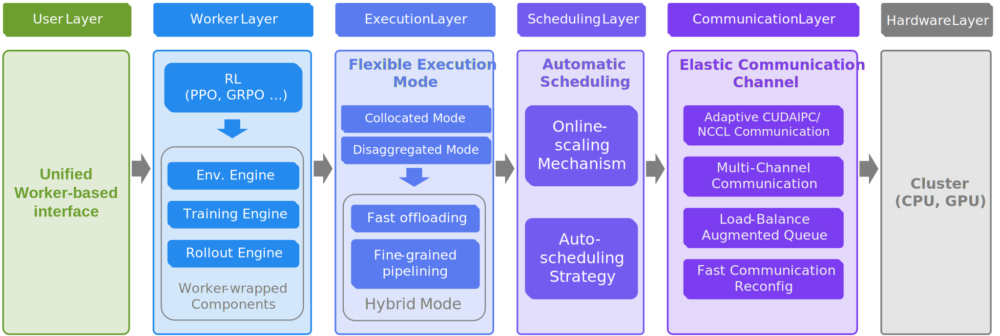

<div align="center">
  
</div>

<div align="center">
<a href="https://arxiv.org/abs/2509.15965"></a>
<a href="https://huggingface.co/RLinf"></a>
<a href="https://rlinf.readthedocs.io/en/latest/"></a>
<a href="https://rlinf.readthedocs.io/zh-cn/latest/"></a>
<a href="https://deepwiki.com/RLinf/RLinf"></a>
<a href="https://github.com/RLinf/misc/blob/main/pic/wechat.jpg?raw=true"></a>
</div>

<div align="center">

[](README.md)
[](README.zh-CN.md)

</div>

<h1 align="center">
  <sub>RLinf: 为具身智能和智能体而生的强化学习框架</sub>
</h1>

RLinf 是一个灵活且可扩展的开源框架，专为具身智能和智能体而设计。名称中的 “inf” 既代表 `Infrastructure`，强调其作为新一代训练坚实基础的作用；也代表 `Infinite`，寓意其支持开放式学习、持续泛化以及智能发展的无限可能。

<div align="center">
  
</div>


## 最新动态
- [2026/01] 🔥 基于[RoboTwin](https://github.com/robotwin-Platform/RoboTwin)的强化学习微调已经上线！文档：[RL on RoboTwin](https://rlinf.readthedocs.io/zh-cn/latest/rst_source/examples/robotwin.html)。
- [2025/12] 🔥 RLinf支持[Search-R1](https://github.com/PeterGriffinJin/Search-R1)的强化学习微调，相比原版实现加速 55%！ 文档: [Search-R1](https://rlinf.readthedocs.io/zh-cn/latest/rst_source/examples/searchr1.html)。
- [2025/12] 🔥 RLinf v0.2-pre 发布！真机Franka的强化学习已经上线。 文档：[RL on Franka in the Real World](https://rlinf.readthedocs.io/zh-cn/latest/rst_source/examples/franka.html)。
- [2025/12] 🔥 基于[RoboCasa](https://github.com/robocasa/robocasa)的强化学习微调已经上线! 文档：[RL on RoboCasa](https://rlinf.readthedocs.io/zh-cn/latest/rst_source/examples/robocasa.html)。
- [2025/12] 🎉 RLinf正式发布[v0.1](https://github.com/RLinf/RLinf/releases/tag/v0.1)版本。
- [2025/11] 🔥 基于[CALVIN](https://github.com/mees/calvin)的强化学习微调已经上线! 文档：[RL on CALVIN](https://rlinf.readthedocs.io/zh-cn/latest/rst_source/examples/calvin.html)。
- [2025/11] 🔥 基于[IsaacLab](https://github.com/isaac-sim/IsaacLab)的强化学习微调已经上线! 文档：[RL on IsaacLab](https://rlinf.readthedocs.io/zh-cn/latest/rst_source/examples/isaaclab.html)。 
- [2025/11] 🔥 RLinf现在已经支持强化学习微调[GR00T-N1.5](https://github.com/NVIDIA/Isaac-GR00T)！文档：[RL on GR00T-N1.5](https://rlinf.readthedocs.io/zh-cn/latest/rst_source/examples/gr00t.html)。
- [2025/11] 🔥 基于[Metaworld](https://github.com/Farama-Foundation/Metaworld)的强化学习微调已经上线! 文档：[RL on Metaworld](https://rlinf.readthedocs.io/zh-cn/latest/rst_source/examples/metaworld.html)。
- [2025/11] 🔥 基于[Behavior 1k](https://github.com/StanfordVL/BEHAVIOR-1K)的强化学习微调已经上线! 文档：[RL on Behavior 1k](https://rlinf.readthedocs.io/zh-cn/latest/rst_source/examples/behavior.html) 。
- [2025/11] lora微调支持π₀和π₀.₅模型。
- [2025/10] 🔥 π₀和π₀.₅模型的强化学习微调已经上线! 文档：[π₀和π₀.₅模型强化学习训练](https://rlinf.readthedocs.io/zh-cn/latest/rst_source/examples/pi0.html)。更多技术细节请参考：[π₀ 与 π₀.₅ 模型强化学习微调技术报告](https://arxiv.org/abs/2510.25889)。机器之心与具身智能之心报道：[《RLinf上新πRL：在线强化学习微调π₀ 和 π₀.₅》](https://mp.weixin.qq.com/s/dFlpmqmE0qfhOQmGG25X9g), [《清华大学最新！πRL：用在线强化学习让机器人 “边学边做” 的通用方案》](https://mp.weixin.qq.com/s/S51P-Y1UYXzumnZzon2N1g)。
- [2025/10] 🔥 RLinf 正式支持在线强化学习！文档：[coding_online_rl](https://rlinf.readthedocs.io/zh-cn/latest/rst_source/examples/coding_online_rl.html)，同时发布文章 [《首个开源的Agent在线强化学习框架RLinf-Online！让你的Agent今天比昨天更聪明》](https://mp.weixin.qq.com/s/jmohmDokuWLhQHFueSHZIQ)。
- [2025/10] 🔥 RLinf算法技术报告 [《RLinf-VLA：一个统一且高效的VLA+RL训练框架》](https://arxiv.org/abs/2510.06710) 已正式发布。
- [2025/09] 🔥 [示例库](https://rlinf.readthedocs.io/zh-cn/latest/rst_source/examples/index.html) 已更新，用户可以在其中找到多种可直接使用的示例！
- [2025/09] 🔥 我们的论文 [《RLinf: Flexible and Efficient Large-scale Reinforcement Learning via Macro-to-Micro Flow Transformation》](https://arxiv.org/abs/2509.15965)已正式发布。
- [2025/09] 🔥 机器之心关于 RLinf 的报道[《首个为具身智能而生的大规模强化学习框架RLinf！清华、北京中关村学院、无问芯穹等重磅开源》](https://mp.weixin.qq.com/s/Xtv4gDu3lhDDGadLrzt6Aw)已经发布。
- [2025/08] RLinf 已经开源，正式的 v0.1 版本即将发布。


## ✨ 核心特性

### 具身智能

<table style="width: 100%; table-layout: auto; border-collapse: collapse;">
  <thead align="center" valign="bottom">
    <tr>
      <th style="min-width: 120px; text-align: left;">模拟器</th>
      <th style="min-width: 120px;">真机</th>
      <th style="min-width: 120px;">模型</th>
      <th style="min-width: 120px;">算法</th>
    </tr>
  </thead>
  <tbody valign="top">
    <tr>
      <td style="text-align: left; padding-left: 8px;">
        <ul style="margin-left: 0; padding-left: 16px;">
          <li><a href="https://rlinf.readthedocs.io/zh-cn/latest/rst_source/examples/maniskill.html">ManiSkill</a> ✅</li>
          <li><a href="https://rlinf.readthedocs.io/zh-cn/latest/rst_source/examples/libero.html">LIBERO</a> ✅</li>
          <li>RoboTwin</li>
          <li>RoboVerse</li>
          <li><a href="https://rlinf.readthedocs.io/zh-cn/latest/rst_source/examples/behavior.html">BEHAVIOR</a> ✅</li>
          <li><a href="https://rlinf.readthedocs.io/zh-cn/latest/rst_source/examples/metaworld.html">MetaWorld</a> ✅</li>
          <li><a href="https://rlinf.readthedocs.io/zh-cn/latest/rst_source/examples/isaaclab.html">IsaacLab</a> ✅</li>
          <li><a href="https://rlinf.readthedocs.io/zh-cn/latest/rst_source/examples/robocasa.html">RoboCasa</a> ✅</li>
          <li>More...</li>
        </ul>
      </td>
      <td>
        <ul style="margin-left: 0; padding-left: 16px;">
          <li><a href="https://rlinf.readthedocs.io/zh-cn/latest/rst_source/examples/franka.html">Franka Arm</a> ✅</li>
          <li>More...</li>
        </ul>
      </td>
      <td>
        <ul style="margin-left: 0; padding-left: 16px;">
          <li><b>VLA 模型</b></li>
          <ul>
            <li><a href="https://rlinf.readthedocs.io/zh-cn/latest/rst_source/examples/pi0.html">π₀</a> ✅</li>
            <li><a href="https://rlinf.readthedocs.io/zh-cn/latest/rst_source/examples/pi0.html">π₀.₅</a> ✅</li>
            <li><a href="https://rlinf.readthedocs.io/zh-cn/latest/rst_source/examples/maniskill.html">OpenVLA</a> ✅</li>
            <li><a href="https://rlinf.readthedocs.io/zh-cn/latest/rst_source/examples/libero.html">OpenVLA-OFT</a> ✅</li>
            <li><a href="https://rlinf.readthedocs.io/zh-cn/latest/rst_source/examples/gr00t.html">GR00T</a> ✅</li>
          </ul>
          <li><b>VLM 模型</b></li>
          <ul>
            <li>Qwen2.5-VL</li>
          </ul>
          <li><b>自定义模型</b></li>
          <ul>
            <li>MLP-Policy ✅</li>
            <li>CNN-Policy ✅</li>
          </ul>
        </ul>
      </td>
      <td>
        <ul style="margin-left: 0; padding-left: 16px;">
          <li><b>RL 算法</b></li>
          <ul>
            <li><a href="https://rlinf.readthedocs.io/zh-cn/latest/rst_source/tutorials/rlalg/grpo.html">GRPO</a> ✅</li>
            <li><a href="https://rlinf.readthedocs.io/zh-cn/latest/rst_source/tutorials/rlalg/ppo.html">PPO</a> ✅</li>
            <li><a href="https://rlinf.readthedocs.io/zh-cn/latest/rst_source/tutorials/rlalg/dapo.html">DAPO</a> ✅</li>
            <li><a href="https://rlinf.readthedocs.io/zh-cn/latest/rst_source/tutorials/rlalg/reinforce.html">Reinforce++</a> ✅</li>
            <li><a href="https://rlinf.readthedocs.io/zh-cn/latest/rst_source/tutorials/rlalg/sac.html">SAC</a> ✅</li>
            <li><a href="https://rlinf.readthedocs.io/zh-cn/latest/rst_source/tutorials/rlalg/crossq.html">CrossQ</a> ✅</li>
            <li><a href="https://rlinf.readthedocs.io/zh-cn/latest/rst_source/tutorials/rlalg/rlpd.html">RLPD</a> ✅</li>
          </ul>
          <li><b>SFT</b></li>
          <ul>
            <li><a href="https://rlinf.readthedocs.io/zh-cn/latest/rst_source/examples/sft.html">全量微调</a> ✅</li>
            <li><a href="https://rlinf.readthedocs.io/zh-cn/latest/rst_source/examples/sft.html">LoRA微调</a> ✅</li>
          </ul>
        </ul>
      </td>
    </tr>
  </tbody>
</table>

### 智能体强化学习

智能体强化学习包括用于提升大语言模型推理能力的强化学习训练，例如[数学推理](https://rlinf.readthedocs.io/zh-cn/latest/rst_source/examples/reasoning.html)；也包括针对各类智能体的强化学习训练，例如[编程智能体的在线强化学习训练](https://rlinf.readthedocs.io/zh-cn/latest/rst_source/examples/coding_online_rl.html)。我们相信，未来的具身智能也必将融合智能体的能力，以完成更复杂的任务。

### 高灵活性、高效性与高可扩展性

除了上述丰富功能外，RLinf 还具有高度灵活性，可支持多种强化学习训练工作流（PPO、GRPO、SAC等），同时隐藏了分布式编程的复杂性。用户无需修改代码即可轻松将强化学习训练扩展至大量GPU节点，满足强化学习训练日益增长的计算需求。

这种高灵活性使 RLinf 能够探索更高效的调度与执行模式。在具身强化学习中，混合执行模式的吞吐量可达现有框架的 **2.434** 倍。

多后端集成支持

- FSDP + HuggingFace/SGLang/vLLM: 快速适配新模型与新算法，非常适合初学者和快速原型验证。
- Megatron + SGLang/vLLM: 针对大规模训练进行了优化，为专家用户提供最大化效率。

## 快速开始
**安装步骤：** 请参考我们的[安装指南](https://rlinf.readthedocs.io/zh-cn/latest/rst_source/start/installation.html)安装RLinf。鉴于具身强化学习的环境配置较为复杂，我们推荐直接使用我们提供的Docker镜像（即[安装方法一：Docker镜像](https://rlinf.readthedocs.io/zh-cn/latest/rst_source/start/installation.html#installation-method-1-docker-image)）。

**运行简单示例：** 环境配置完成后，用户可以参照[该文档](https://rlinf.readthedocs.io/zh-cn/latest/rst_source/start/vla.html)的内容，运行基于ManiSkill3模拟器的具身强化学习基础示例。

用户可以查阅我们的[官方文档](https://rlinf.readthedocs.io/zh-cn/latest/index.html)与[示例库](https://rlinf.readthedocs.io/zh-cn/latest/rst_source/examples/index.html)，来了解更多RLinf的使用教程与应用实例。


## 主要成果
### 具身智能

- RLinf 同时支持 PPO 与 GRPO 算法，为视觉-语言-动作（Vision-Language-Action, VLA）模型提供最先进的训练能力。
- 该框架与主流具身智能基准测试无缝集成，并在多样化的评测指标上均取得了优异表现。

#### OpenVLA 和 OpenVLA-OFT 结果

<div align="center">
<table border="0">
  <tr>
    <td align="center">
      
      <br/>
      <strong>OpenVLA</strong>
    </td>
    <td align="center">
      
      <br/>
      <strong>OpenVLA-OFT</strong>
    </td>
  </tr>
</table>
</div>

- 在 ManiSkill 环境 “PutOnPlateInScene25Mani-v3” 上，使用 OpenVLA 与 OpenVLA-OFT 模型进行训练。结果显示，在 PPO 与 GRPO 算法的对比中，PPO 始终表现优于 GRPO，且训练过程更加稳定。

<div align="center">
<table style="text-align:center;">
  <tr>
    <th colspan="6" style="text-align:center;"> <strong>在 ManiSkill 上的评测结果。表中数值表示任务的成功率（Success Rate）</strong></th>
  </tr>
  <tr>
    <td style="text-align:center;"></td>
    <th rowspan="2" colspan="1" style="text-align:center;">In-Distribution</th>
    <td colspan="4" style="text-align:center;"><strong>Out-Of-Distribution</strong></td>
  
  </tr>
  <tr>
    <th style="text-align:center;"></th>
    <th style="text-align:center;">Vision</th>
    <th style="text-align:center;">Semantic</th>
    <th style="text-align:center;">Execution</th>
    <th style="text-align:center;">Avg.</th>
  </tr>
  <tr>
    <td style="text-align:center;">OpenVLA (Base)</td>
    <td style="text-align:center;">53.91%</td>
    <td style="text-align:center;">38.75%</td>
    <td style="text-align:center;">35.94%</td>
    <td style="text-align:center;">42.11%</td>
    <td style="text-align:center;">39.10%</td>
  </tr>
  <tr>
    <td style="text-align:center;"><a href="https://huggingface.co/gen-robot/openvla-7b-rlvla-rl">RL4VLA (PPO)</a></td>
    <td style="text-align:center;">93.75%</td>
    <td style="text-align:center;">80.47%</td>
    <td style="text-align:center;">75.00%</td>
    <td style="text-align:center;">81.77%</td>
    <td style="text-align:center;">79.15%</td>
  </tr>
  <tr>
    <td style="text-align:center;"><a href="https://huggingface.co/RLinf/RLinf-OpenVLA-GRPO-ManiSkill3-25ood">OpenVLA (RLinf-GRPO)</a></td>
    <td style="text-align:center;">84.38%</td>
    <td style="text-align:center;">74.69%</td>
    <td style="text-align:center;">72.99%</td>
    <td style="text-align:center;">77.86%</td>
    <td style="text-align:center;">75.15%</td>
  </tr>
  <tr>
    <td style="text-align:center;"><a href="https://huggingface.co/RLinf/RLinf-OpenVLA-PPO-ManiSkill3-25ood">OpenVLA (RLinf-PPO)</a></td>
    <td style="text-align:center;"><strong>96.09%</strong></td>
    <td style="text-align:center;">82.03%</td>
    <td style="text-align:center;"><strong>78.35%</strong></td>
    <td style="text-align:center;"><strong>85.42%</strong></td>
    <td style="text-align:center;"><strong>81.93%</strong></td>
  </tr>
  <tr>
    <td colspan="6" style="text-align:center;"></td>
  </tr>
  <tr>
    <td style="text-align:center;">OpenVLA-OFT (Base)</td>
    <td style="text-align:center;">28.13%</td>
    <td style="text-align:center;">27.73%</td>
    <td style="text-align:center;">12.95%</td>
    <td style="text-align:center;">11.72%</td>
    <td style="text-align:center;">18.29%</td>
  </tr>
  <tr>
    <td style="text-align:center;"><a href="https://huggingface.co/RLinf/RLinf-OpenVLAOFT-GRPO-ManiSkill3-25ood">OpenVLA-OFT (RLinf-GRPO)</a></td>
    <td style="text-align:center;">94.14%</td>
    <td style="text-align:center;">84.69%</td>
    <td style="text-align:center;">45.54%</td>
    <td style="text-align:center;">44.66%</td>
    <td style="text-align:center;">60.64%</td>
  </tr>
  <tr>
    <td style="text-align:center;"><a href="https://huggingface.co/RLinf/RLinf-OpenVLAOFT-PPO-ManiSkill3-25ood">OpenVLA-OFT (RLinf-PPO)</a></td>
    <td style="text-align:center;"><strong>97.66%</strong></td>
    <td style="text-align:center;"><strong>92.11%</strong></td>
    <td style="text-align:center;">64.84%</td>
    <td style="text-align:center;">73.57%</td>
    <td style="text-align:center;">77.05%</td>
  </tr>
</table>
</div>


<div align="center">
<table style="text-align:center;">
  <tr>
    <th colspan="7" style="text-align:center;"><strong>统一模型在五个 LIBERO 任务组上的评测结果</strong></th>
  </tr>
  <tr>
    <th style="text-align:center;">Model</th>
    <th style="text-align:center;">Spatial</th>
    <th style="text-align:center;">Object</th>
    <th style="text-align:center;">Goal</th>
    <th style="text-align:center;">Long</th>
    <th style="text-align:center;">90</th>
    <th style="text-align:center;">Avg.</th>
  </tr>
  <tr>
    <td style="text-align:center;"><a href="https://huggingface.co/RLinf/RLinf-OpenVLAOFT-LIBERO-130-Base-Lora">OpenVLA-OFT (Base)</a></td>
    <td style="text-align:center;">72.18%</td>
    <td style="text-align:center;">71.48%</td>
    <td style="text-align:center;">64.06%</td>
    <td style="text-align:center;">48.44%</td>
    <td style="text-align:center;">70.97%</td>
    <td style="text-align:center;">65.43%</td>
  </tr>
  <tr>
    <td style="text-align:center;"><a href="https://huggingface.co/RLinf/RLinf-OpenVLAOFT-LIBERO-130">OpenVLA-OFT (RLinf-GRPO)</a></td>
    <td style="text-align:center;"><strong>99.40%</strong></td>
    <td style="text-align:center;"><strong>99.80%</strong></td>
    <td style="text-align:center;"><strong>98.79%</strong></td>
    <td style="text-align:center;"><strong>93.95%</strong></td>
    <td style="text-align:center;"><strong>98.59%</strong></td>
    <td style="text-align:center;"><strong>98.11%</strong></td>
  </tr>
  <tr>
    <td style="text-align:center;">Δ Improvement</td>
    <td style="text-align:center;">+27.22</td>
    <td style="text-align:center;">+28.32</td>
    <td style="text-align:center;">+34.73</td>
    <td style="text-align:center;">+45.51</td>
    <td style="text-align:center;">+27.62</td>
    <td style="text-align:center;">+32.68</td>
  </tr>
</table>
</div>

#### &pi;<sub>0</sub> and &pi;<sub>0.5</sub> Results

<div align="center">
<table style="text-align:center; width:80%; margin:0 auto;">
  <tr>
    <th colspan="8" style="text-align:center;"><strong>在四个LIBERO任务组上的评测结果</strong></th>
  </tr>
  <tr>
    <th rowspan="2" colspan="2" style="text-align:center;">Model</th>
    <th colspan="6" style="text-align:center;">LIBERO</th>
  </tr>
  <tr>
    <th style="text-align:center;">Spatial</th>
    <th style="text-align:center;">Object</th>
    <th style="text-align:center;">Goal</th>
    <th style="text-align:center;">Long</th>
    <th style="text-align:center;">Avg.</th>
    <th style="text-align:center;">&Delta; Avg.</th>
  </tr>

  <!-- Full Dataset SFT (6 rows) -->
  <tr>
    <td colspan="8" style="text-align:center; font-style:italic;"><strong>Full Dataset SFT</strong></td>
  </tr>
  <tr>
    <td colspan="2" style="text-align:center;">Octo</td>
    <td style="text-align:center;">78.9%</td>
    <td style="text-align:center;">85.7%</td>
    <td style="text-align:center;">84.6%</td>
    <td style="text-align:center;">51.1%</td>
    <td style="text-align:center;">75.1%</td>
    <td style="text-align:center;">—</td>
  </tr>
  <tr>
    <td colspan="2" style="text-align:center;">OpenVLA</td>
    <td style="text-align:center;">84.7%</td>
    <td style="text-align:center;">88.4%</td>
    <td style="text-align:center;">79.2%</td>
    <td style="text-align:center;">53.7%</td>
    <td style="text-align:center;">76.5%</td>
    <td style="text-align:center;">—</td>
  </tr>
  <tr>
    <td colspan="2" style="text-align:center;">&pi;<sub>fast</sub></td>
    <td style="text-align:center;">96.4%</td>
    <td style="text-align:center;">96.8%</td>
    <td style="text-align:center;">88.6%</td>
    <td style="text-align:center;">60.2%</td>
    <td style="text-align:center;">85.5%</td>
    <td style="text-align:center;">—</td>
  </tr>
  <tr>
    <td colspan="2" style="text-align:center;">OpenVLA-OFT</td>
    <td style="text-align:center;">91.6%</td>
    <td style="text-align:center;">95.3%</td>
    <td style="text-align:center;">90.6%</td>
    <td style="text-align:center;">86.5%</td>
    <td style="text-align:center;">91.0%</td>
    <td style="text-align:center;">—</td>
  </tr>
  <tr>
    <td colspan="2" style="text-align:center;">&pi;<sub>0</sub></td>
    <td style="text-align:center;">96.8%</td>
    <td style="text-align:center;">98.8%</td>
    <td style="text-align:center;">95.8%</td>
    <td style="text-align:center;">85.2%</td>
    <td style="text-align:center;">94.2%</td>
    <td style="text-align:center;">—</td>
  </tr>
  <tr>
    <td colspan="2" style="text-align:center;">&pi;<sub>0.5</sub></td>
    <td style="text-align:center;">98.8%</td>
    <td style="text-align:center;">98.2%</td>
    <td style="text-align:center;">98.0%</td>
    <td style="text-align:center;">92.4%</td>
    <td style="text-align:center;">96.9%</td>
    <td style="text-align:center;">—</td>
  </tr>

  <!-- Few-shot SFT + RL: pi_0 -->
  <tr>
    <td colspan="8" style="text-align:center; font-style:italic;"><strong>Few-shot Dataset SFT + RL</strong></td>
  </tr>
  <tr>
    <td rowspan="3" style="text-align:center;">&pi;<sub>0</sub></td>
    <td style="text-align:center;">
      <a href="https://www.modelscope.cn/models/RLinf/RLinf-Pi0-SFT-Spatial-Object-Goal">
        
      </a>
      <a href="https://huggingface.co/RLinf/RLinf-Pi0-SFT-Spatial-Object-Goal">
        SFT
      </a>
    </td>
    <td style="text-align:center;">65.3%</td>
    <td style="text-align:center;">64.4%</td>
    <td style="text-align:center;">49.8%</td>
    <td style="text-align:center;">51.2%</td>
    <td style="text-align:center;">57.6%</td>
    <td style="text-align:center;">—</td>
  </tr>
  <tr>
    <td style="text-align:center;">Flow-SDE</td>
    <td style="text-align:center;">98.4%</td>
    <td style="text-align:center;">99.4%</td>
    <td style="text-align:center;">96.2%</td>
    <td style="text-align:center;">90.2%</td>
    <td style="text-align:center;">96.1%</td>
    <td style="text-align:center;">+38.5</td>
  </tr>
  <tr>
    <td style="text-align:center;">Flow-Noise</td>
    <td style="text-align:center;">99.0%</td>
    <td style="text-align:center;">99.2%</td>
    <td style="text-align:center;">98.2%</td>
    <td style="text-align:center;">93.8%</td>
    <td style="text-align:center;">97.6%</td>
    <td style="text-align:center;"><b>+40.0</b></td>
  </tr>

  <!-- Few-shot SFT + RL: pi_0.5 -->
  <tr>
    <td colspan="8" style="text-align:center; font-style:italic;"><strong>Few-shot Dataset SFT + RL</strong></td>
  </tr>
  <tr>
    <td rowspan="3" style="text-align:center;">&pi;<sub>0.5</sub></td>
    <td style="text-align:center;">
      <a href="https://www.modelscope.cn/models/RLinf/RLinf-Pi05-SFT">
        
      </a>
      <a href="https://huggingface.co/RLinf/RLinf-Pi05-SFT">
        SFT
      </a>
    </td>
    <td style="text-align:center;">84.6%</td>
    <td style="text-align:center;">95.4%</td>
    <td style="text-align:center;">84.6%</td>
    <td style="text-align:center;">43.9%</td>
    <td style="text-align:center;">77.1%</td>
    <td style="text-align:center;">—</td>
  </tr>
  <tr>
    <td style="text-align:center;">Flow-SDE</td>
    <td style="text-align:center;">99.6%</td>
    <td style="text-align:center;">100%</td>
    <td style="text-align:center;">98.8%</td>
    <td style="text-align:center;">93.0%</td>
    <td style="text-align:center;">97.9%</td>
    <td style="text-align:center;">+20.8</td>
  </tr>
  <tr>
    <td style="text-align:center;">Flow-Noise</td>
    <td style="text-align:center;"><b>99.6%</b></td>
    <td style="text-align:center;"><b>100%</b></td>
    <td style="text-align:center;"><b>99.6%</b></td>
    <td style="text-align:center;"><b>94.0%</b></td>
    <td style="text-align:center;"><b>98.3%</b></td>
    <td style="text-align:center;">+21.2</td>
  </tr>
</table>
</div>


### 数学推理

<div align="center">
<table>
  <tr>
    <th colspan="5" style="text-align:center;"><strong>1.5B model results</strong></th>
  </tr>
  <tr>
    <th>Model</th>
    <th>AIME 24</a></th>
    <th>AIME 25</a></th>
    <th>GPQA-diamond</a></th>
    <th>Average</th>
  </tr>
  <tr>
    <td><a href="https://huggingface.co/deepseek-ai/DeepSeek-R1-Distill-Qwen-1.5B">DeepSeek-R1-Distill-Qwen-1.5B (base model)</a></td>
    <td>28.33</td><td>24.90</td><td>27.45</td><td>26.89</td>
  </tr>
  <tr>
    <td><a href="https://huggingface.co/zwhe99/DeepMath-1.5B">DeepMath-1.5B</a></td>
    <td>37.80</td><td>30.42</td><td>32.11</td><td>33.44</td>
  </tr>
  <tr>
    <td><a href="https://huggingface.co/agentica-org/DeepScaleR-1.5B-Preview">DeepScaleR-1.5B-Preview</a></td>
    <td>40.41</td><td>30.93</td><td>27.54</td><td>32.96</td>
  </tr>
  <tr>
    <td><a href="https://huggingface.co/inclusionAI/AReaL-1.5B-Preview-Stage-3">AReaL-1.5B-Preview-Stage-3</a></td>
    <td>40.73</td><td>31.56</td><td>28.10</td><td>33.46</td>
  </tr>
  <tr>
    <td>AReaL-1.5B-retrain*</td>
    <td>44.42</td><td>34.27</td><td>33.81</td><td>37.50</td>
  </tr>
  <tr>
    <td><a href="https://huggingface.co/Nickyang/FastCuRL-1.5B-V3">FastCuRL-1.5B-V3</a></td>
    <td>43.65</td><td>32.49</td><td>35.00</td><td>37.05</td>
  </tr>
  <tr>
    <td><a href="https://huggingface.co/RLinf/RLinf-math-1.5B"><strong>RLinf-math-1.5B</strong></a></td>
    <td><strong>48.44</strong></td><td><strong>35.63</strong></td><td><strong>38.46</strong></td><td><strong>40.84</strong></td>
  </tr>
</table>
</div>

\* 我们使用默认设置对模型进行了 600 步的重新训练。

<div align="center">
<table>
  <tr>
    <th colspan="5" style="text-align:center;"><strong>7B model results</strong></th>
  </tr>
  <tr>
    <th>Model</th>
    <th>AIME 24</a></th>
    <th>AIME 25</a></th>
    <th>GPQA-diamond</a></th>
    <th>Average</th>
  </tr>
  <tr>
    <td><a href="https://huggingface.co/deepseek-ai/DeepSeek-R1-Distill-Qwen-7B">DeepSeek-R1-Distill-Qwen-7B (base model)</a></td>
    <td>54.90</td><td>40.20</td><td>45.48</td><td>46.86</td>
  </tr>
  <tr>
    <td><a href="https://huggingface.co/inclusionAI/AReaL-boba-RL-7B">AReaL-boba-RL-7B</a></td>
    <td>61.66</td><td>49.38</td><td>46.93</td><td>52.66</td>
  </tr>
  <tr>
    <td><a href="https://huggingface.co/Skywork/Skywork-OR1-7B">Skywork-OR1-7B</a></td>
    <td>66.87</td><td>52.49</td><td>44.43</td><td>54.60</td>
  </tr>
  <tr>
    <td><a href="https://huggingface.co/POLARIS-Project/Polaris-7B-Preview">Polaris-7B-Preview</a></td>
    <td><strong>68.55</strong></td><td>51.24</td><td>43.88</td><td>54.56</td>
  </tr>
  <tr>
    <td><a href="https://huggingface.co/nvidia/AceMath-RL-Nemotron-7B">AceMath-RL-Nemotron-7B</a></td>
    <td>67.30</td><td><strong>55.00</strong></td><td>45.57</td><td>55.96</td>
  </tr>
  <tr>
    <td><a href="https://huggingface.co/RLinf/RLinf-math-7B"><strong>RLinf-math-7B</strong></a></td>
    <td>68.33</td><td>52.19</td><td><strong>48.18</strong></td><td><strong>56.23</strong></td>
  </tr>
</table>
</div>

- RLinf 在数学推理任务上实现了当前最先进的性能，在多个基准测试（AIME 24、AIME 25、GPQA-diamond）中，1.5B 与 7B 规模的模型均稳定超越现有方法。

## 路线图

### 1. 系统级增强
- [X] 支持异构 GPU

- [ ] 支持异步流水线执行

- [X] 支持专家混合（Mixture of Experts, MoE）

### 2. 应用级扩展
- [X] 支持视觉-语言模型（VLMs）训练

- [ ] 支持深度搜索智能体训练

- [ ] 支持多智能体训练
- [ ] 支持更多具身模拟器的集成 (如 [GENESIS](https://github.com/Genesis-Embodied-AI/Genesis), [RoboTwin](https://github.com/RoboTwin-Platform/RoboTwin))  
- [ ] 支持更多VLA模型 (如[WALL-OSS](https://huggingface.co/x-square-robot/wall-oss-flow))
- [ ] 支持世界模型（World Model）

- [x] 支持真实世界的具身智能强化学习

# 持续集成测试状态
RLinf 具有全面的 CI 测试，涵盖核心组件（通过单元测试）和具身、智能体和推理场景的端到端 RL 训练工作流。
以下是主分支 CI 测试状态的摘要：

| 测试名 | 状态 |
| -------- | ------ |
| 单元测试 |  |
| 智能体/推理端到端测试 |  |
| 具身智能端到端测试 |  |
| 调度器测试 |  |

## 贡献指南
我们欢迎对 RLinf 的贡献。在参与之前，请先阅读 [贡献指南](https://github.com/RLinf/RLinf?tab=contributing-ov-file#contributing-to-rlinf)。感谢以下贡献者，并诚邀更多开发者加入我们的开源项目，共建具身智能与强化学习系统。

<a href="https://github.com/RLinf/RLinf/graphs/contributors"></a>

## 引用与致谢

如果您觉得 **RLinf** 对您的研究或工作有所帮助，请引用以下论文：

```bibtex
@article{yu2025rlinf,
  title={RLinf: Flexible and Efficient Large-scale Reinforcement Learning via Macro-to-Micro Flow Transformation},
  author={Yu, Chao and Wang, Yuanqing and Guo, Zhen and Lin, Hao and Xu, Si and Zang, Hongzhi and Zhang, Quanlu and Wu, Yongji and Zhu, Chunyang and Hu, Junhao and others},
  journal={arXiv preprint arXiv:2509.15965},
  year={2025}
}
```

如果你在 RLinf 中使用了 RL+VLA，欢迎引用我们的算法技术报告和实证研究论文：

```bibtex
@article{zang2025rlinf,
  title={RLinf-VLA: A Unified and Efficient Framework for VLA+ RL Training},
  author={Zang, Hongzhi and Wei, Mingjie and Xu, Si and Wu, Yongji and Guo, Zhen and Wang, Yuanqing and Lin, Hao and Shi, Liangzhi and Xie, Yuqing and Xu, Zhexuan and others},
  journal={arXiv preprint arXiv:2510.06710},
  year={2025}
}
```

```bibtex
@article{liu2025can,
  title={What can rl bring to vla generalization? an empirical study},
  author={Liu, Jijia and Gao, Feng and Wei, Bingwen and Chen, Xinlei and Liao, Qingmin and Wu, Yi and Yu, Chao and Wang, Yu},
  journal={arXiv preprint arXiv:2505.19789},
  year={2025}
}
```

```bibtex
@article{chen2025pi_,
  title={$$\backslash$pi\_$\backslash$texttt $\{$RL$\}$ $: Online RL Fine-tuning for Flow-based Vision-Language-Action Models},
  author={Chen, Kang and Liu, Zhihao and Zhang, Tonghe and Guo, Zhen and Xu, Si and Lin, Hao and Zang, Hongzhi and Zhang, Quanlu and Yu, Zhaofei and Fan, Guoliang and others},
  journal={arXiv preprint arXiv:2510.25889},
  year={2025}
}
```

**致谢**
RLinf 的灵感来源并受益于更广泛开源社区的思想与工具。
我们特别感谢 VeRL、AReaL、Megatron-LM、SGLang 和 PyTorch Fully Sharded Data Parallel (FSDP) 的团队与贡献者。
如果我们不慎遗漏了您的项目或贡献，请提交 issue 或 pull request，以便我们能够给予您应有的致谢。

**联系方式：**
我们欢迎博士后、博士/硕士研究生以及实习生的加入。
诚邀您共同塑造强化学习基础设施与具身智能的未来！
- Chao Yu: zoeyuchao@gmail.com
- Yu Wang: yu-wang@tsinghua.edu.cn
